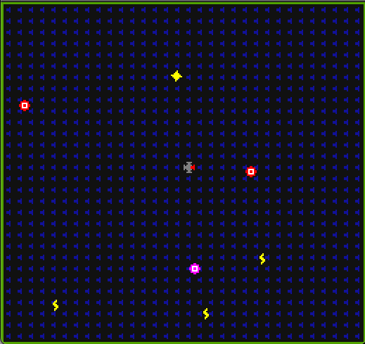

# Redirekt

Author: Gustavo Silvera

Design: 2D "bullet-hell" style game where the objective is to maximize your score in a set amount of time by redirecting projectiles (in the 4 cardinal directions) to hit targets. 

Screen Shot:

How Your Asset Pipeline Works:

(TODO: describe the steps in your asset pipeline, from source files to tiles/backgrounds/whatever you upload to the PPU466.)

(TODO: make sure the source files you drew are included. You can [link](your/file.png) to them to be a bit fancier.)

How To Play:

(TODO: describe the controls and (if needed) goals/strategy.)

This game was built with [NEST](NEST.md).

